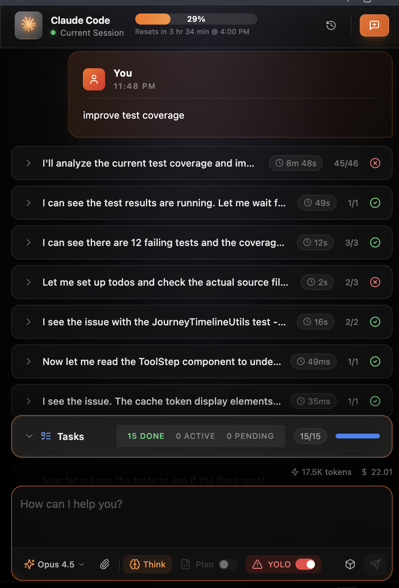

<h1 align="center">Claude Code GUI</h1>

<p align="center">
  <strong>See Claude Code think, plan, and operate — live inside VS Code.</strong>
</p>

<p align="center">
  <a href="https://marketplace.visualstudio.com/items?itemName=MaheshKok.claude-code-gui">
    
  </a>
  <a href="https://marketplace.visualstudio.com/items?itemName=MaheshKok.claude-code-gui">
    
  </a>
  <a href="https://github.com/MaheshKok/claude-code-gui-vscode/blob/main/LICENSE">
    
  </a>
</p>

<p align="center">
  <a href="#why-this-exists">Why</a> •
  <a href="#highlights">Highlights</a> •
  <a href="#quick-start">Quick Start</a> •
  <a href="#modes--controls">Modes &amp; Controls</a> •
  <a href="#configuration">Configuration</a> •
  <a href="#development">Development</a>
</p>

---

<p align="center">
  
</p>

## Why this exists

Claude Code CLI is powerful, but most of its work happens invisibly in a terminal. Claude Code GUI turns the CLI into a visual cockpit: you can watch tool calls, diffs, token usage, and progress in real time without leaving VS Code.

If you’ve ever wanted to **see the work, not just the answer**, this is for you.

## Highlights

- **Journey Timeline** — messages, tool calls, and results grouped into a readable, collapsible flow.
- **Tool intelligence** — per-tool duration and token counts with structured inputs and rich outputs.
- **Diff-first edits** — inline diffs, open-in-VS Code diff, and one-click revert.
- **Live progress** — `TodoWrite` steps render into a task panel while Claude works.
- **Usage cockpit** — header meter + detailed modal for session and weekly usage/reset times.
- **Permission control** — allow/deny tool requests, Plan mode (read-only), YOLO mode (skip prompts).
- **MCP hub** — preseeded servers (Chrome, Context7, Sequential Thinking, Memory, Puppeteer, Fetch, Filesystem) with toggle/add/remove.
- **Conversation history** — automatic saving, search, restore, delete.
- **Sidebar + editor panel** — open the chat where you like.

## How it works

1. Extension host spawns `claude` with `--output-format stream-json`.
2. CLI events stream into the webview via `postMessage`.
3. React UI renders streaming output, tool cards, diffs, usage, and history.

## Quick Start

### Prerequisites

```bash
npm install -g @anthropic-ai/claude-code
claude auth login
```

> Requires VS Code 1.94+. The extension expects `claude` on your PATH.

### Open the chat

- `Cmd+Shift+C` (macOS) / `Ctrl+Shift+C` (Windows/Linux)
- Command Palette → "Open Claude Code GUI"
- Activity Bar → Claude icon

### First message

1. Type a prompt.
2. Press Enter to send.
3. Watch the timeline fill in as Claude works.

## Modes & Controls

- **Model selector** — Sonnet 4.5 (default), Opus 4.5, Haiku 4.5.
- **Thinking mode** — Think → Ultrathink for deeper reasoning.
- **Plan mode** — read-only tool permissions (safe analysis).
- **YOLO mode** — skip permission prompts (use with caution).

## Configuration

Settings live under `Claude Code GUI` in VS Code.

| Setting                              | Default                      | Description             |
| ------------------------------------ | ---------------------------- | ----------------------- |
| `claudeCodeGui.claude.model`         | `claude-sonnet-4-5-20250929` | Default Claude model    |
| `claudeCodeGui.thinking.enabled`     | `true`                       | Enable thinking mode    |
| `claudeCodeGui.thinking.intensity`   | `think`                      | Thinking intensity      |
| `claudeCodeGui.permissions.yoloMode` | `false`                      | Skip permission prompts |

## Development

### Setup

```bash
git clone https://github.com/MaheshKok/claude-code-gui-vscode.git
cd claude-code-gui-vscode
npm install
```

### Build & watch

```bash
npm run build
npm run dev
```

> `npm run dev` uses Bun for the watch scripts. Install Bun or run the individual `watch:*` scripts.

### Available Commands

| Command             | Description          |
| ------------------- | -------------------- |
| `npm run build`     | Build for production |
| `npm run dev`       | Watch mode           |
| `npm run lint`      | Run ESLint           |
| `npm run typecheck` | TypeScript check     |
| `npm run test`      | Run tests            |
| `npm run package`   | Create .vsix file    |

## Contributing

Contributions are welcome!

1. Fork the repository
2. Create a feature branch (`git checkout -b feature/amazing`)
3. Commit your changes (`git commit -m 'Add amazing feature'`)
4. Push to the branch (`git push origin feature/amazing`)
5. Open a Pull Request

### Code Standards

- TypeScript for all code
- ESLint + Prettier formatting
- Tests for new features
- Descriptive commit messages

## License

This project is licensed under the MIT License — see `LICENSE`.

---

<p align="center">
  <strong>Made with ❤️ by <a href="https://github.com/MaheshKok">Mahesh Kokare</a></strong>
</p>

<p align="center">
  <a href="https://github.com/MaheshKok/claude-code-gui-vscode/issues">Report Bug</a> •
  <a href="https://github.com/MaheshKok/claude-code-gui-vscode/issues">Request Feature</a> •
  <a href="https://github.com/MaheshKok/claude-code-gui-vscode/discussions">Discussions</a>
</p>

<p align="center">
  ⭐ Star this repo if you find it useful!
</p>
